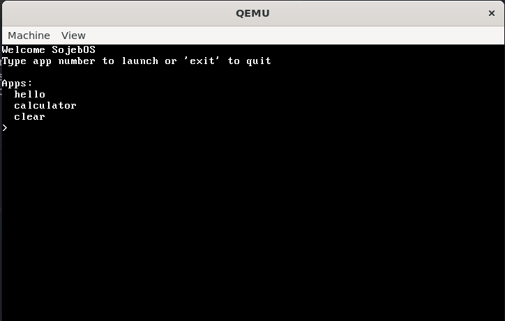

## Description
SojebOS is a basic operating system

## Screenshots



## Build Instructions
```bash
# Install dependencies
sudo apt install build-essential nasm mtools xorriso grub-pc-bin grub-common
# Build
make
# Run 
make run
```
